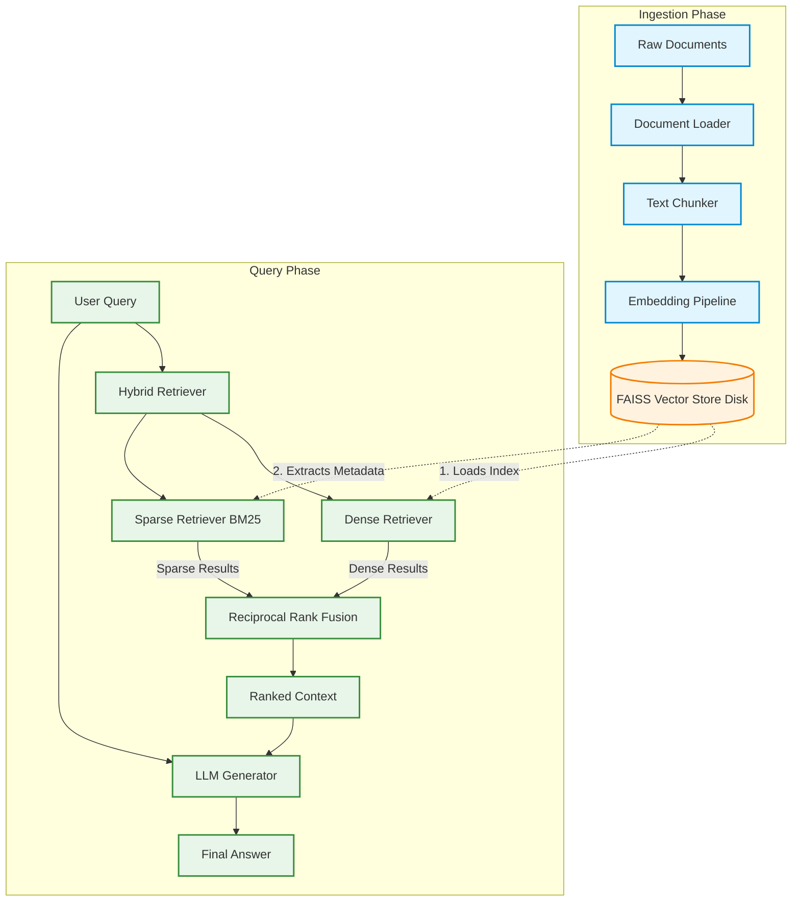

# Hybrid RAG Project

A robust Retrieval-Augmented Generation (RAG) system built with FastAPI, LangChain, FAISS, and BM25. This project implements a **Hybrid Retrieval** architecture that combines dense vector search with sparse keyword search to provide highly relevant context for generation.

## 🏗️ Architecture Flow

The system is designed with a strict separation between the **Ingestion Phase** and the **Retrieval/Generation Phase** to ensure production-grade performance and prevent index corruption.

### 1. Ingestion Pipeline
This phase is responsible for processing raw documents and building the persistent dense vector index. It runs independently from the retrieval API.

* **Document Loading** (`app/ingestion/loader.py`): Parses raw files (PDFs, CSVs, etc.) from the `data/` directory.
* **Chunking** (`app/ingestion/chunker.py`): Splits the extracted text into manageable chunks with overlap.
* **Embedding** (`app/embeddings/embedding.py`): Generates dense vector representations for each chunk using `sentence-transformers`.
* **Vector Store** (`app/vectorstores/faiss_store.py`): Stores embeddings and their corresponding chunk metadata into a FAISS index, which is then persisted to disk (`vector_store/faiss`).

### 2. Retrieval & Generation Pipeline
This phase operates at query time. It loads the pre-built indexes to rapidly fetch relevant context and generate answers.

* **Index Initialization**: 
    * The **Dense Retriever** loads the persisted FAISS index directly from disk.
    * The **Sparse Retriever** rebuilds its BM25 index in-memory by extracting the chunk metadata natively from the loaded FAISS index (bypassing the need to re-read or re-chunk raw documents).
* **Hybrid Search** (`app/retrieval/hybrid_retriever.py`):
    * **Dense Search**: Queries FAISS for semantically similar chunks.
    * **Sparse Search**: Queries BM25 for exact keyword matches.
* **Reciprocal Rank Fusion (RRF)** (`app/retrieval/fusion.py`): Merges and re-ranks the results from both the dense and sparse retrievers to provide the optimal context.
* **Generation** (`app/generation/generator.py`): Passes the user query and the RRF-ranked context to an LLM (via LangChain/Groq) to generate a grounded response.

### Architecture Diagram



## 🚀 Getting Started

### Prerequisites
* Python 3.11+
* `uv` package manager

### Setup
1. Clone the repository.
2. Install dependencies:
   ```bash
   uv sync
   ```
3. Set up your environment variables by creating a `.env` file (e.g., adding API keys for generation or `HF_TOKEN`).

### Usage

**1. Ingest Documents**
Place your source files in the `data/` directory and run the ingestion script to build the FAISS index:
```bash
uv run python scripts/ingest.py
```

**2. Test Hybrid Retrieval**
To test the retrieval quality and hybrid ranking logic directly:
```bash
uv run python scripts/test_hybrid.py
```

**3. Run the API Server**
Start the FastAPI server:
```bash
uv run uvicorn app.main:app --reload
```
